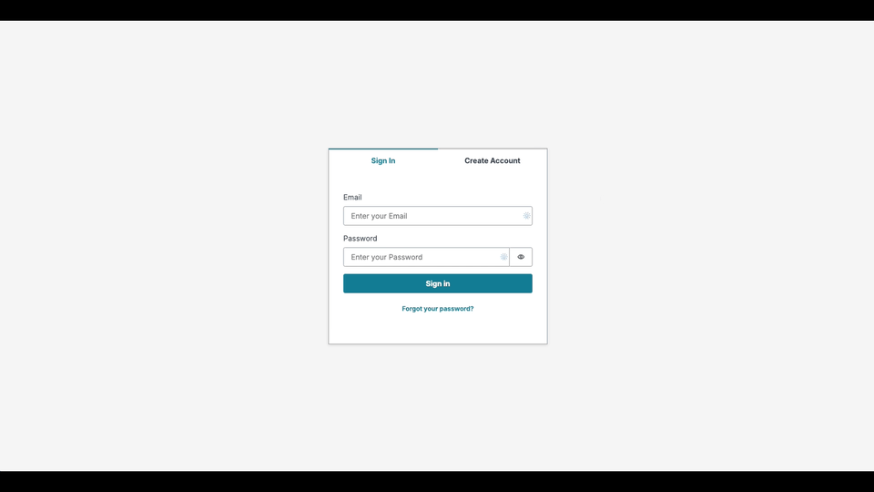

## Creating a Generative AI  Travel Assistant App with Amazon Bedrock and AWS Amplify

This is an example shows how to build a travel assistant app. The app will provide a personalized experience by suggesting popular attractions, local experiences, and hidden gems for the user's desired destination. We will build this app using AWS mplify and Amazon Bedrock.



## Getting Started
### Clone repo

```

git clone https://github.com/aws-samples/travel-personal-assistant.git
cd travel-personal-assistant

```

### Install the packages

```

npm i

```

### Initiate a cloud sandbox environment

```

npx ampx sandbox

```

### Run the App

```

npm run dev

```


## Security

See [CONTRIBUTING](CONTRIBUTING.md#security-issue-notifications) for more information.

## License

This library is licensed under the MIT-0 License. See the LICENSE file.

